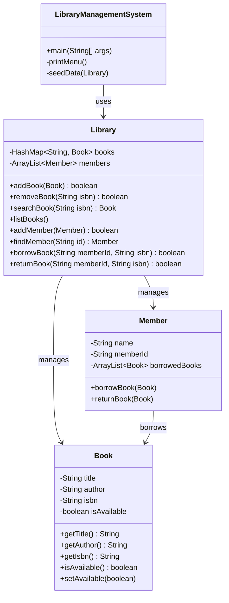

# 📚 Library Management System

A console-based Library Management System built in Java, focused on applying core OOP principles — encapsulation, separation of concerns, and clean class design — over a real, functioning domain model.

Built as part of a structured Java learning roadmap (OOP fundamentals → Collections → Exceptions/Generics → File I/O → Spring Boot).

---

## ✨ Features

- ➕ Add / remove books from the catalog
- 🔍 Search books by ISBN
- 📋 List the full catalog
- 🧑 Register library members
- 🔄 Borrow and return books, with availability tracking
- 🌱 Pre-seeded demo data on startup
- 🎨 Colorized console UI (ANSI escape codes) with success/error indicators

---

## 🖥️ How It Looks

```
╔══════════════════════════════════════╗
║       LIBRARY MANAGEMENT SYSTEM       ║
╠══════════════════════════════════════╣
 1. Add Book        5. Add Member
 2. Remove Book      6. Borrow Book
 3. List Books       7. Return Book
 4. Search Book      8. Exit
╚══════════════════════════════════════╝
Enter your choice: 6

--- BORROW BOOK ---
Member ID: M001
ISBN: 001
✔ Book borrowed successfully.
```

```
--- LIBRARY CATALOG ---
The Hobbit by J.R.R. Tolkien (ISBN: 001) [Checked out]
1984 by George Orwell (ISBN: 002) [Available]
Clean Code by Robert C. Martin (ISBN: 003) [Available]
```

---

## 🏗️ Architecture

The project follows a clean **separation of concerns**: the UI layer (`LibraryManagementSystem`) never touches raw data directly — it only talks to `Library`, which owns and enforces all the rules.



**Why it's structured this way:**
- `Library` is the single source of truth — books and members are never accessed or modified from outside it
- Borrowing is a *transaction between two objects* (`Book` + `Member`), so that logic lives in `Library`, not shoved into either class alone
- `LibraryManagementSystem` (the `main` class) is a pure UI layer — it only reacts to `true`/`false` results and decides what to print

---

## 🗂️ Project Structure

```
├── LibraryManagementSystem.java   # Entry point + console menu (UI layer)
├── Library.java                   # Core logic: owns books & members, enforces rules
├── Book.java                      # Book entity
└── Member.java                    # Member entity
```

---

## 🚀 Getting Started

1. Clone the repo
2. Open in IntelliJ IDEA (or any Java IDE)
3. Run `LibraryManagementSystem.java`
4. Use the menu to add books, register members, and borrow/return items

**Requirements:** JDK 11+

---

## 🛣️ Roadmap

This project is intentionally left open for expansion as I progress through my Java learning path:

- [ ] Custom exceptions (`BookNotAvailableException`, `MemberNotFoundException`, etc.)
- [ ] Generic `Repository<T>` to unify book/member management
- [ ] Overdue tracking with due dates (`LocalDate`)
- [ ] File I/O — persist library state between runs
- [ ] Eventually: wrap this in a Spring Boot REST API

---

## 🧠 What This Project Demonstrates

| Concept | Where |
|---|---|
| Encapsulation | Private fields + controlled access across all entity classes |
| Separation of Concerns | UI layer never touches raw collections directly |
| Collections Framework | `HashMap` for O(1) ISBN lookups, `ArrayList` for ordered lists |
| Clean method design | Boolean-based success/failure contracts between layers |

---

*Built as part of a self-directed Java roadmap — OOP → Collections → Exceptions/Generics → File I/O → Spring Boot.*
